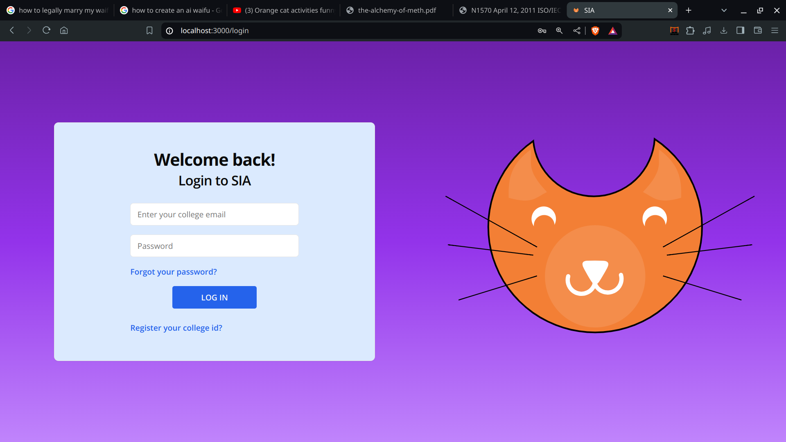

# SIA (Social Interaction Application/(platform for Academia) - we're still figuring out the name)
<p align="center">
    
</p>

Front end of DBMS project made with [Next.js](https://nextjs.org/) bootstrapped with [`create-next-app`](https://github.com/vercel/next.js/tree/canary/packages/create-next-app).

## How it looks
Just click the link listed on the side or below bruh.
If you are too lazy to click the link, here's a little preview of the website.


## Getting Started

First, install the necessary packages using the npm as(If you're fancy you can even use pnpm):
```bash
npm i
```
Complex command, I know. Now then, let's run the development server:

```bash
npm run dev
```

Open [http://localhost:3000](http://localhost:3000) with your browser to see the result.

This project uses [`next/font`](https://nextjs.org/docs/basic-features/font-optimization) to automatically optimize and load Inter, a custom Google Font.

## Deployed website

This project is deployed @ [Vercel](https://sia-electrocord.vercel.app/)

## Wanna read stuff?

- [Next.js Documentation](https://nextjs.org/docs) - learn about Next.js features and API.
- [Learn Next.js](https://nextjs.org/learn) - an interactive Next.js tutorial.

> [!Bug]
> - If you find any bugs, please report them to the issues section of this repository.
> - If you have any suggestions, please report them to the issues section of this repository.
